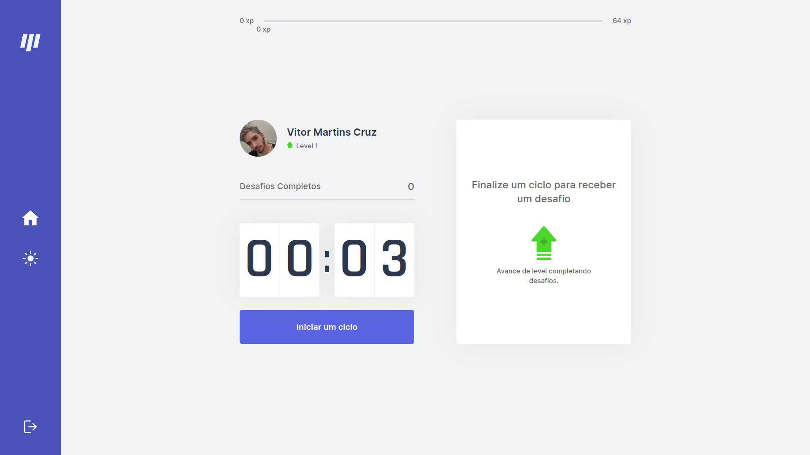

<p align="center"></p>


> An application developed during the NLW # 04 event of RocketSeat.


<p align="center">
     
    
    
    <!--  -->
</p> 

<h2 align="center">
    🚧    In Production    🚧
</h2>

<!-- ABOUT --> 
We all know that spending hours and hours in front of the computer is not healthy, in addition to the user losing his focus or even decreasing his performance in this long period.
 
Knowing this, Move It came to correct this problem: every 25 minutes, the user receives a new activity to perform, going from level to according to the experience acquired.

Thus, these small exercises increase the productivity and focus of the customer, in addition to making the use of the computer less stressful. 

<!-- DEMO --> 
## 🎥 Demo

<!-- This project was deployed in [Vercel](https://vercel.com). To see a demo, [click here](https://move-it-app-opal.vercel.app/).  -->

> PS: For demonstration purposes, the time has been reduced to just 3 seconds.

<div align="center">
     
    
      
</div>

## ✅ My Changes

- [x] Make the app responsive 

- [x] Add a Dark Theme

- [x] Transform into a PWA (Progressive Web App)

- [x] Apply a preprocessor (SCSS)

- [x] Place a side bar 

- [x] Insert a login screen

- [x] Configure OAuth (GitHub) 

- [ ] Add leaderboard ranking

<!-- TECHONOLOGIES --> 
## 🚀 Technologies
* ✔️ HTML
* ✔️ CSS (SCSS)
* ✔️ JavaScript
* ✔️ React JS (Context API, Hooks, Next.js)
* ✔️ TypeScript

<!-- HOW TO USE -->
## ℹ️ How To Use
To modify (locally) this project, you will need [Node](https://nodejs.org/en/) and [GIT](https://git-scm.com/) installed on your computer.

With these tools in hand, follow the steps below
```sh
# Clone this repository
$ git clone https://github.com/vitormrts/move-it-app

# Go to the repository cloned
$ cd move-it-app

# Install dependencies
$ npm install

# Run the app
$ npm run dev
```

Done! Now you have this application in your computer.

<!-- CONTRIBUTING -->
## 🤝 Contributing

To contributing to this project, follow the steps bellow.

1. Fork the Project;
2. Create your Feature Branch (`git checkout -b new-branch`)
3. Commit your Changes (`git commit -m 'DESCRIPTION OF CHANGES'`)
4. Push to the Branch (`git push origin new-branch`)
5. Open a Pull Request

## 📝 License
This project is under the MIT license. See the [LICENSE](https://github.com/vitormrts/move-it-app/blob/master/LICENSE) file for more details.

---

<p align="center">Made with ❤️ by <strong>Vitor Martins ✌ </p>


 

